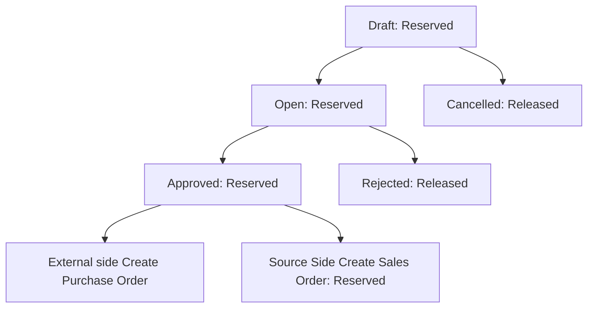
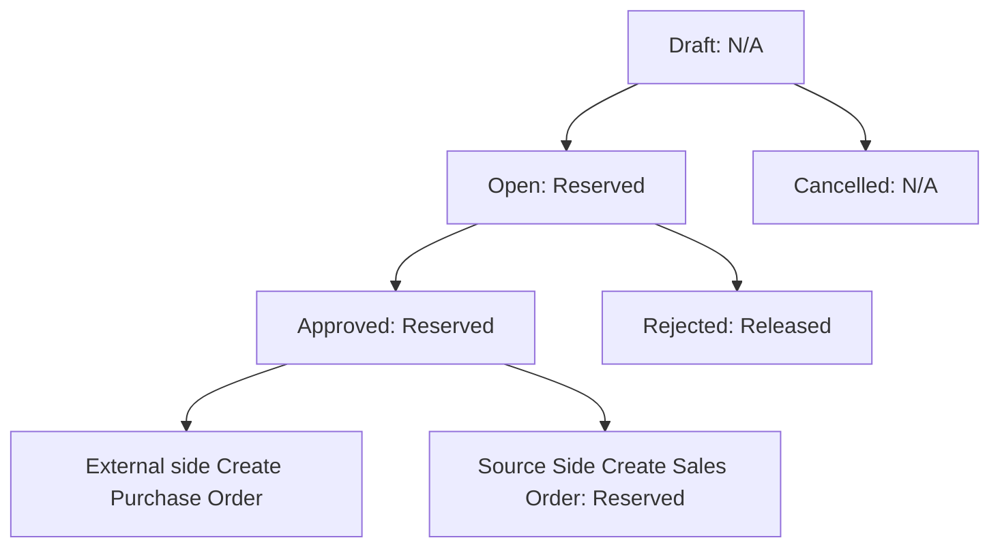
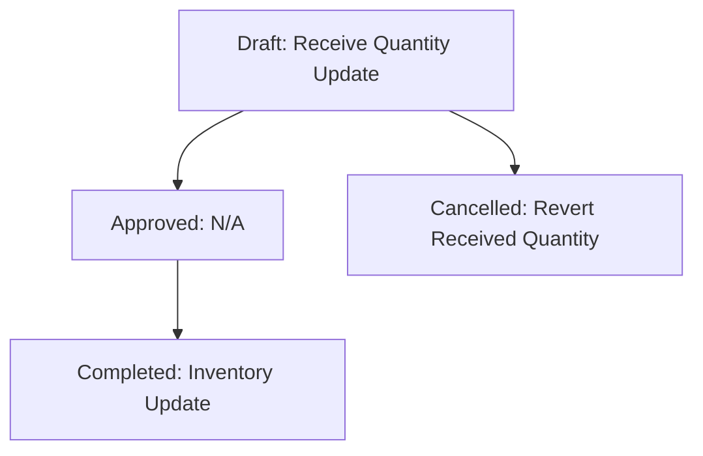
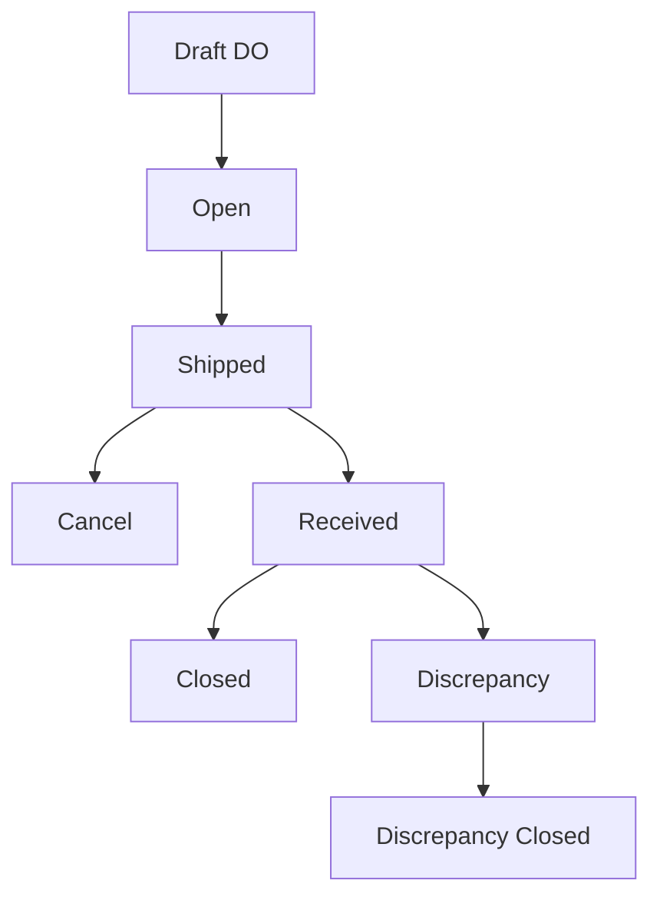

# Purchase Order Module Documentation

## Table of Contents

1.  [List Page](#list-page)

2.  [Creating Purchase Orders](#creating-purchase-orders)

3.  [Delivery Orders](#delivery-orders)

4.  [Purchase Order Invoices](#purchase-order-invoices)

## List Page

### What is the Purchase Order List Page?

The Purchase Order list page is your central dashboard for managing all types of orders in your retail system. It helps you:

- View all your purchase orders in one place

- Track order status and progress

- Manage transfers between locations

- Handle purchase requests and order fulfillment

### Who is it for?

- Store Managers

- Warehouse Managers

- Admin

### Why use it?

- Keep track of all your Purchase orders in one place

- Easily find specific Purchase orders

- Monitor Purchase order status

- Create new Purchase orders quickly

- Access delivery orders and related documents

### Using the Purchase Order List

#### Accessing the List

1. Log into your ERP system

2. From the main menu, click on "Purchase Orders"

3. You'll see the Purchase Orders list page with all your orders

#### Understanding the Screen Layout

##### Top Section:

-  **Page Title**: "Purchase Orders" appears at the top

-  **Action Buttons** (on the right):

- "Delivery Orders" - View all delivery orders

- "Purchase Request" - Create a new purchase request

- "Transfer Request" - Create a new transfer request

##### Main List View:

The list shows your Purchase orders with these important details:

- Date

- Transfer Type

- Order Number

- From (source location)

- To (destination location)

- Status

- Items

- Reference Number

- Actions

#### Using the Filters

To find specific orders:

1. Click the "Filters" button to show filter options

2. You can filter by:

- External Company

- External Location Selection (Store or Warehouse)

- External Store/External Warehouse

- Location Selection (Store or Warehouse)

- Store/Warehouse

- Status (e.g., Draft, Approved, Completed)

- Order Type

- Order Number

- Date Range (select start and end dates)

3. After selecting filters:

- Automatically will apply filters

- Click "Clear" to remove all filters

#### Viewing Order Details

Each order in the list shows:

1.  **Status Badges**: Colored badges showing current status

2.  **Order Numbers**: If applicable, you'll see different types of order numbers

3.  **Location Info**:

- From: Source location (hover to see company name)

- To: Destination location (hover to see company name)

### Common Tasks

#### Search for Orders:

1. Use the search box at the top of the list

2. Type in the order number or reference number

3. Results will update automatically

#### Export Data:

1. Use the export buttons above the list to:

- Download as CSV

- Download as Excel

#### View Order Items:

1. Click on the items count in the "Items" column

2. A pop-up will show:

- Id

- Name

- UPC

- Color

- Size

- Quantity

- Rejected Quantity

- Transferred Quantity

- Price Per Unit

- Remarks

 ##### Search for Orders:

1. Use the search box at the top of the list

2. Results will update automatically

##### Export Data:

1. Use the export buttons above the list to:

- Download as CSV

- Download as Excel

### Understanding Status Types

Orders can have different statuses:

- Draft: New or unprocessed orders

- Open: Orders being processed

- Approved: Orders that have been reviewed and approved

- Cancelled: Orders that were stopped

- Rejected: Orders that were not approved

- Partial Fulfillment: Orders partial completed

- Fulfillment Completed: Orders Fully completed but not closed

- Closed: Fully processed orders

### Tips and Tricks

- Use the date range filter to find orders from a specific time period

- Click column headers to sort the list

- Hover over information icons (ℹ️) to see additional details

- Use the "Clear" button to remove all filters and start fresh

### Troubleshooting

Common situations and what to do:

- If you can't find an order: Check your filters and try clearing them

- If you need to see more details: Click on the items count

- If you need to track order progress: Look at the status badges

- If you need to see delivery status: Click "Delivery Orders" button

## Transfer Request Process

### Overview

A Transfer Request is used to move products between different External Company and External locations (stores or warehouses). Here's the complete lifecycle of a transfer request:

### 1. Creating a Draft Transfer Request

1. Click "Transfer Request" button from the main Purchase Orders page

2. Fill in the required information:

- From (Source Location)

- Select External Company

- To (External Location)

- Reference Number

- Delivery by

- Attention

- Remarks

- ##### Items to transfer:

	- In `Product Selection` there are multiple ways to add them:
		- Using Search By (Name, Upc) and Using Filter

		- By Advance Selection
			- You can specify the article number and add from there.

			- You can apply same quantity to all as well

		- By Bulk Upload:
			- You can download the sample file.

			- Add details in that sample file UPC, and quantity and upload it back

	* Specify Transfer quantity for each product (Can select the derivative option if available)

	* You can delete the item if not needed

3. System will validate:

	- Stock availability

	- Required fields

4. Click "Submit" to save as draft and the quantity will be **`Reserved`**.

### 2. Opening a Transfer Request

After creating a draft:

1. The source location can:

	- Review the draft

	- Make any necessary adjustments to quantities (Edit)

	- Click "Open" to submit for approval. Then it will create the External side `Transfer Request`

**Note:**   Currently it is auto approval from the external side.

### 3. External Side Approval Process If Not Approved Then

When a transfer request is opened:

1. Approvers will see the request in their list

2. They can:

	- Review product details

	- Check quantities and availability

3. Actions available:

	-  **Approve**: Moves the request forward

	-  **Reject**: Sends back for revision

**Note:**
		- Source Location Side It Will Create **`Sales Order`**
		- External Side (Destination) It Will Create **`Purchase Order`**

### 4. Cancelling a Transfer Request
When a transfer request is in Draft can cancel the transfer and reserved stock will be **`Revert`**

### Inventory Status Throughout Transfer Process

#### 1. Draft Status

- Inventory Status: **Reserved**

* System automatically reserves the requested quantities

* Stock becomes unavailable for other transactions

* Available stock is reduced, but physical stock remains unchanged

* Reserved quantities appear in stock reports with "Reserved" status

#### 2. Open Status

- Inventory Status: **Reserved**

* Continues reservation from draft status

* Stock remains unavailable for other transactions

* System maintains reservation until approval/rejection

#### 3. Approved Status

- Inventory Status: **Reserved**

* Continues reservation from draft status

* Stock remains unavailable for other transactions

#### 4. Rejected Status

- Inventory Status: **Released**

* All reserved quantities are released back to available stock

* Stock becomes available for other transactions

* System removes "Reserved" status

* Inventory returns to normal available state

#### 5. Cancelled Status

- Inventory Status: **Released**

* Similar to rejection:

- All reservations are removed

- Stock returns to available status

### Status Flow Summary

## Purchase Request Process

### Overview

A Purchase Request (PR) is used to request products from External Company and External Location. It's the first step in the procurement process and helps track what needs to be purchased.

### 1. Creating a Draft Purchase Request

1. Click "Purchase Request" button from the main Purchase Orders page

2. Fill in the required information:

- Select External Company

- From (External Location)

- To (Source Location)

- Reference Number

- Delivery by

- Attention

- Remarks

- ##### Items to transfer:

	- In `Product Selection` there are multiple ways to add them:
		- Using Search By (Name, Upc) and Using Filter

		- By Advance Selection
			- You can specify the article number and add from there.

			- You can apply same quantity to all as well

		- By Bulk Upload:
			- You can download the sample file.

			- Add details in that sample file UPC, and quantity and upload it back

	* Specify Transfer quantity for each product (Can select the derivative option if available)

	* You can delete the item if not needed

3. System will validate:

	- Stock availability

	- Required fields

4. Click "Submit" to save as draft.

### 2. Opening a Purchase Request

After creating a draft:

1. The source location can:

	- Review the draft

	- Make any necessary adjustments to quantities (Edit)

	- Click "Open" to submit for approval. Then it will create the External side `Purchase Request` and quantity will be **`Reserved`**.

### 3. External Side Approval Process

When a purchase request is opened:

1. Approvers will see the request in their list

2. They can:

	- Review product details

	- Check quantities and availability

3. Actions available:

	-  **Approve**: Moves the request forward

	-  **Reject**: Sends back for revision

**Note:**
		- Source Location Side It Will Create **`Sales Order`**
		- External Side (Destination) It Will Create **`Purchase Order`**

### 4. Cancelling a Purchase Request
When a purchase request is in Draft can cancel

### Inventory Status Throughout Transfer Process

#### 1. Draft Status

-  N/A

#### 2. Open Status

- Inventory Status: **Reserved**

* Stock remains unavailable for other transactions

* System maintains reservation until approval/rejection

#### 3. Approved Status

- Inventory Status: **Reserved**

* Continues reservation from Open status

* Stock remains unavailable for other transactions

#### 4. Rejected Status

- Inventory Status: **Released**

* All reserved quantities are released back to available stock

* Stock becomes available for other transactions

* System removes "Reserved" status

* Inventory returns to normal available state

#### 5. Cancelled Status

- Inventory Status: **Released**

* Similar to rejection:

- All reservations are removed

- Stock returns to available status

### Status Flow Summary

  DONE

## Sales Order Process (SO)

### Overview

When transfer request is approved Source Side sales order (SO) is created. And when purchase request is approved the External Side Sales Order is created

### Sales Order Status Flow

#### 1. Cancel

- Releases the reserved stock
- After Delivery Order shipped, Sales Order or Purchase Order can not be deleted.

#### 2. Partial Fulfillment
-   Orders partial completed

#### 3. Partial Complete

- Orders partial completed not closed
- And Inventory is fully updated.

#### 4. Close

- Sales Order Complete

## Purchase Order Process (PO)

### Overview

When Purchase request is approved source side purchase order (PO) is created. And transfer request is approved external side purchase order (PO) is created.

### Purchase Order Status Flow

#### 1. Cancel

- Releases the reserved stock
- After Delivery Order shipped, Sales Order or Purchase Order can not be deleted.

#### 2. Partial Fulfillment
-   Orders partial completed

#### 3. Partial Complete

- Orders partial completed not closed
- And Inventory is fully updated.

#### 4. Close

- Purchase Order Complete

## Delivery Order Process

### Overview

A Delivery Order (DO) is created on Sales Order Side. It manages the physical movement of goods between locations and tracks the actual shipment process.

### 1. Creating a Delivery Order

1. Access Points:

- Click "Create DO" button

- Delivery Orders list: Click "Create" button

2. Basic Information:

- Date: Select delivery date (required)

- Notes: Add any special instructions or remarks

3. Package Details:

- Package Type: Select from available options (Box, Carton, Pallet, etc.)

- Package Quantity: Number of packages for each type

- Items per Package: Quantity of items in each package

4. Product Shipping Details:

For each product:

- Original Quantity: Shows quantity from transfer request

- Quantity to Ship: Enter actual quantity being shipped

- Package Type Selection: Choose package type for the product

- Package Type Quantity: Number of packages for this product

- Quantity per Package: Items per package for this product

- Batch Number: If applicable for tracking

- Remarks: Any product-specific notes

5. Validation Checks:

- Total quantities match original request

- Package quantities are properly distributed

- All required fields are filled

- Batch numbers are valid (if applicable)

### 2. Inventory Impact During DO Creation

#### Before DO Creation

- Source Location:

* Stock Status: **Allocated**

* Physical stock: Still available

* System status: Reserved for transfer

#### After DO Creation

- Source Location:

* Stock Status: **Picked**

* Physical stock: Reduced

* Available stock: Reduced

* In-transit: Increased

- Destination Location:

* Expected Receipt: Created

* In-transit: Visible in reports

### 3. DO Status Flow

#### Draft

- Initial status when DO is created

- Inventory Status: N/A

#### Open

- Inventory Status: N/A

#### Shipped
-  Source (Sales Order Side): Deduct Stock and Reserved Stock
- Destination (Purchase Order Side): Add In Transit Stock

#### Received

- Inventory Status: N/A

#### Partial Receive

- Can create the partial receive.
- Statuses
	- Draft
		- Update the quantity in partial receive field.
	- Approved
		- Inventory NA
	- Complete
		- Remove the transit stock, and inventory update destination side
	- Cancel
		- Revert the quantity in partial receive field.

Partial Receive Status Flow:

#### Discrepancy

- When the received  stock is greater than or less than transfer quantity then discreapancy is created.
- Inventory: N/A
- Need to upload the discrepancy proof

#### Closed

1. Normal Closure:

- Remove the transit stock, and inventory update destination side

2. Discrepancy Closure:

- When receive more than the transfer quantity then extra received quantity deduct in reserved stock and update inventory source side.
- When receive less than the transfer quantity then partial received quantity add in reserved stock and update inventory source side.
- Remove the transit stock, and inventory update destination side.

### Status Flow Summary

## 📚 Abbreviations / Short Forms

| Short Form | Full Form         |
|------------|-------------------|
| TR         | Transfer Request  |
| PR         | Purchase Request  |
| SO         | Sales Order       |
| PO         | Purchase Order    |
| DO         | Delivery Order    |

